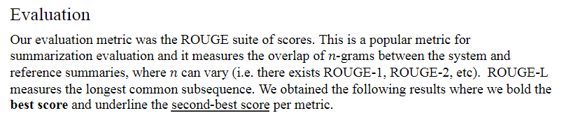

# Hunter College - Natural Language Processing - Professor Sarah Ita Levitan
## Muhammad Tanveer & Ansh Bhargava

## Extractive vs Abstractive Text Summarization

Text summarization is a critical task in natural language processing, with two primary methods: abstractive and extractive summarization. This project explores the differences between these approaches by leveraging the PEGASUS and BERTSUM pre-trained models and evaluating their effectiveness using various metrics. The research focuses on summarizing long documents and investigates the performance of abstractive, extractive, and hybrid methods. The project utilizes datasets from CNN/DailyMail news articles and WikiHow instructional guides. A baseline model, selecting the first few sentences as the summary, is established for comparison. Results show that the baseline performs well due to the salient information being presented early in these domains, but caution is needed when generalizing to other contexts. Future work involves testing in different domains and on longer texts to enhance method effectiveness.

You can read more about the project in the [Final Report](https://github.com/tanveerm176/NLP_TextSummarization/blob/main/NLP_%20FinalProject_Report-1.pdf), view our [Presentation Slides](https://github.com/tanveerm176/NLP_TextSummarization/blob/main/NLP%20Project%20Presentation.pdf) and see how we implemented the project via [Jupyter Notebook](https://github.com/tanveerm176/NLP_TextSummarization/blob/main/NLP_Project_Summarizers.ipynb).

Here is a breakdown of the project

## Overview of Dataset

## Evaluation Method

## Baseline Model 
* Our baseline model for summarization was simply to select the first sentences from the article 𝑘
as our summary.

* We notice that around 4 is the number of sentences from the start of the article that seems to
perform the best amongst our baseline models. However, the evidence is not particularly
convincing for this.
We also notice that the scores for CNN/DailyMail are higher than WikiHow. This is intuitive
since CNN/DailyMail are news articles which tend to put the most important information early in
the article, whereas the WikiHow articles are instructional guides where the most important
information is spread out throughout the article. This structural difference indicates that a better
performing model would likely be able to discern importance beyond simple position in an
article.

## Abstractive Summarizer (PEGASUS)

* For this project we used the pre-trained abstractive summarizer PEGASUS (Pre-training with
Extracted Gap-sentences for Abstractive Summarization). This is a self supervised model that is
trained to produce an abstracted summary of text from an input text that is masked. When tasked
with abstractive summarization, it performs really well on major metrics. However since it is a
transformer based model, it has a finite context window and therefore loses performance over
longer documents. This model also does not take into account the document’s structure or
sectioning which may impact its performance.

## Extractive Summarizer (BERTSUM)

* For the extractive summarizer we opted to use the BERTSUM (Bidirectional Encoder
Representations from Transformers) model. This pre-trained model uses words in both the
previous and next context of a target word to create word embeddings. It allows for masked
inputs to be detected as well as relations between two concurrent sentences. Concurrent
sentences are rated based on their relation to one another, from completely related to not related
at all. From there BERTSUM builds on BERT by classifying whether or not sentences belong in
the summary i.e. their level of importance in relation to the text.

## Custom Hybrid Summarizers
### Graph Summarizer

* This method first converts the input text into a similarity matrix using TF-IDF vectorization and
cosine similarity. The TextRank algorithm is then applied to this matrix to create a graph
representation of the sentences, where nodes represent sentences and edges represent the
similarity between them. The importance scores of each sentence are calculated using the
PageRank algorithm. The top-ranked sentences are selected as the most important ones and are
used as input for an abstractive summarization function to generate a final summary.
Two key features of this are:
    
    1. By modeling the sentences as nodes in a graph and considering the similarity between
them, the method captures the relationships and contextual information within the text,
resulting in more coherent and relevant summaries.
    
    2. The graph-based approach can handle large amounts of text efficiently, as the calculations
are based on matrix operations and graph algorithms, which are well-suited for
parallelization and optimization.

### Emsemble Summarizer

* This method leverages both extractive and abstractive summaries, ranking sentences in their
outputs to generate a final summary. Specifically, it first extracts all sentences from both
summaries and removes duplicates. Then, similar to the graph summarizer, we use PageRank to
score each sentence (across both summaries) and finally return the top (n=5)sentences with the
highest PageRank scores.
Two key features of this are:
    
    1. Comprehensive Information Coverage: By combining extractive and abstractive
summarization techniques, the ensemble approach aims to capture the strengths of both
methods. Extractive summarization ensures that important sentences from the original
text are included, preserving factual accuracy. Abstractive summarization, on the other
hand, can generate more concise and coherent summaries by rephrasing and paraphrasing
the content.
    
    2. Customizability and Flexibility: The ensemble approach allows for flexibility and
customization by incorporating multiple summarization techniques. It enables the use of
various extractive and abstractive algorithms, giving the ability to adapt to different text
types, lengths, and summarization requirements. This flexibility allows for better
optimization and tailoring of the summarization process to specific use cases or
preferences.
* We also implemented the following methods, but weren’t able to test fully due to compute
constraints: two-step hybrid summarization, length weighted hybrid summarization, hierarchical
summarization, iterative summarization. Our appendix contains a description of these and the
submitted notebook contains their implementation.

### Other Summarizers

## Results and Evaluation

* In conclusion, our baseline method has demonstrated remarkable performance relative to most
other methods employed in our study. It is tempting to conclude that our machine learning
models are not as capable in comparison. However, it is important to consider the specific
domains we tested, namely news articles and how-to guides, as they are designed to encapsulate
the most salient information within the first few sentences. Consequently, the baseline's superior
performance in these domains may not necessarily translate to other subject areas.
Furthermore, the success of extractive models in our study may be attributed to the nature of the
data. Selecting key phrases and sentences from the source text aligns well with the structure of
news articles and how-to guides, where certain phrases are deliberately intended to be "key."
However, this may not hold true in many other domains, where the main ideas and connections
between sections play a more significant role in conveying information.
Therefore, while the baseline's strong performance and the success of extractive models in our
specific data are noteworthy, caution should be exercised when extrapolating these results to
other domains.

## Future Work
* In the future, there are several avenues of research that can be explored to further enhance the
effectiveness of our methods. One important direction is to test the applicability of our
approaches on other source domains where the content structure differs from news articles and
how-to articles. This includes domains such as medical reports, legal briefs, and financial
documents, where the key information may not always be captured in the first few sentences. By
adapting our methods to handle these variations, we can expand the utility of our techniques in a
broader range of contexts.

* Another area for future work is to test the effectiveness of our methods on longer texts. While
our current focus has been on news articles, it would be valuable to evaluate how well our
approaches perform on lengthier documents. Longer texts often present additional challenges in
information extraction and summarization, as they contain more nuanced and intricate details. By
investigating the performance of our methods on longer texts, we can assess their scalability and
identify potential areas for improvement.
